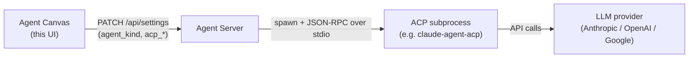

# Using ACP agents

Agent Canvas can drive your conversations with the built-in **OpenHands** agent or
with an external **ACP agent** — Claude Code, Codex, or Gemini CLI. This guide
explains what ACP agents are, how to onboard one, and how to switch agents or
models later.

## What is an ACP agent?

The [Agent Client Protocol (ACP)](https://agentclientprotocol.com/protocol/overview)
is a standard for talking to coding agents over JSON-RPC on stdio. Instead of
Agent Canvas calling an LLM directly, the Agent Server spawns the agent's own CLI
as a subprocess and relays each turn to it. The external agent manages its own
LLM, tools, and execution; Agent Canvas sends messages and renders what comes
back.

The Agent Server owns the subprocess and the credentials; Agent Canvas only
records *which* agent to run and surfaces a form for the secrets it needs. The
agent choice is stored per backend, so switching backends can switch agents.

## Supported providers

The provider list is sourced from the SDK registry
(`openhands.sdk.settings.acp_providers`, mirrored into
`@openhands/typescript-client`) and enriched with Canvas UI metadata in
[`src/constants/acp-providers.ts`](../src/constants/acp-providers.ts). Adding or
changing a provider happens upstream in the SDK, not here.

| Provider | Default command | Auth | Credentials step |
|---|---|---|---|
| **Claude Code** | `npx -y @agentclientprotocol/claude-agent-acp` | `ANTHROPIC_API_KEY`, or a Claude subscription login | API key + optional base URL |
| **Codex** | `npx -y @zed-industries/codex-acp` | `OPENAI_API_KEY`, or a ChatGPT login | API key + optional base URL |
| **Gemini CLI** | `npx -y @google/gemini-cli --acp` | Interactive Google OAuth login | *skipped* — no static key |

> [!NOTE]
> Use the wrappers above, not the vendor CLIs directly. For example
> `npx -y @openai/codex acp` looks plausible but is **not** an ACP server — it
> has no `acp` subcommand and silently deadlocks the handshake. Use
> `@zed-industries/codex-acp` instead.

## Onboarding an ACP agent

First-time users get a four-step onboarding modal. To onboard an ACP agent:

1. **Choose agent** — pick Claude Code, Codex, or Gemini CLI instead of
   OpenHands. The choice is saved immediately to your backend's settings.
2. **Check backend** — confirms Agent Canvas can reach the Agent Server.
3. **Set up credentials** — enter the provider's API key (and, optionally, a
   custom base URL for a proxy or gateway). This step is **skipped for Gemini
   CLI**, which authenticates through an interactive OAuth login rather than a
   static key.
4. **Say hello** — creates your first conversation and closes the modal.

> [!NOTE]
> Every credential field is optional and the step is skippable. Leave a field
> blank to reuse a key already set on the backend, or to authenticate the agent
> through a subscription / OAuth login instead.

### How credentials reach the agent

Each credential you enter is saved as a **global secret** whose name is exactly
the environment variable the Agent Server exports into the ACP subprocess (e.g.
`ANTHROPIC_API_KEY`). Saving in onboarding is identical to adding the secret
under **Settings → Secrets**, where you can edit or remove it anytime. Keeping
the secret name equal to the env var is what makes a saved key actually reach the
provider CLI.

Secret names must match `^[a-zA-Z][a-zA-Z0-9_]{0,63}$`. API keys are stored
masked; base-URL overrides are plain text.

> [!NOTE]
> A subscription / OAuth login takes precedence over an API key. For Claude Code,
> if the backend is configured for a Claude login (`CLAUDE_CONFIG_DIR`), a
> conflicting `ANTHROPIC_API_KEY` / `ANTHROPIC_BASE_URL` is stripped so it can't
> silently break the login.

## Switching agent or model later

Open **Settings → Agent** at any time:

- **Agent** — switch between **OpenHands** and **ACP**.
- **Preset** — pick a built-in provider (Claude Code, Codex, Gemini CLI) or
  **Custom** to point at any other ACP server.
- **Command** — the command line used to spawn the subprocess. Selecting a preset
  fills this in; editing it to match another preset re-detects that provider.
  API keys are *not* entered here — they live in the Secrets panel.
- **Model** — choose a suggested model for the provider or enter a custom model
  override. Built-in providers save a concrete model rather than leaving it
  blank.

Saving writes an `agent_settings_diff` (`agent_kind`, `acp_server`,
`acp_command`, `acp_model`) to `PATCH /api/settings`. A running conversation
keeps the agent it started with; the new choice applies to conversations you
start afterward.

## Custom ACP servers

Any stdio ACP server works: choose **Custom** in Settings → Agent and enter its
launch command. Custom servers have no curated model list, so enter the model ID
the server expects (if any) as a custom model. Pass credentials by adding the
env vars the server reads as global secrets under **Settings → Secrets**.

## Troubleshooting

- **Agent never responds / conversation hangs on start** — the command is likely
  not a real ACP server (see the note above). Verify the package and that it
  speaks ACP over stdio.
- **Auth errors** — confirm the secret name matches the provider's env var
  exactly (e.g. `ANTHROPIC_API_KEY`) and that it's set on the backend you're
  connected to. Secrets are per backend.
- **Model not found** — the provider may not offer that model for your account;
  pick a suggested model or correct the custom override.
- **Wrong agent after switching backends** — the agent choice is stored per
  backend. Check **Settings → Agent** on the backend you're connected to.
